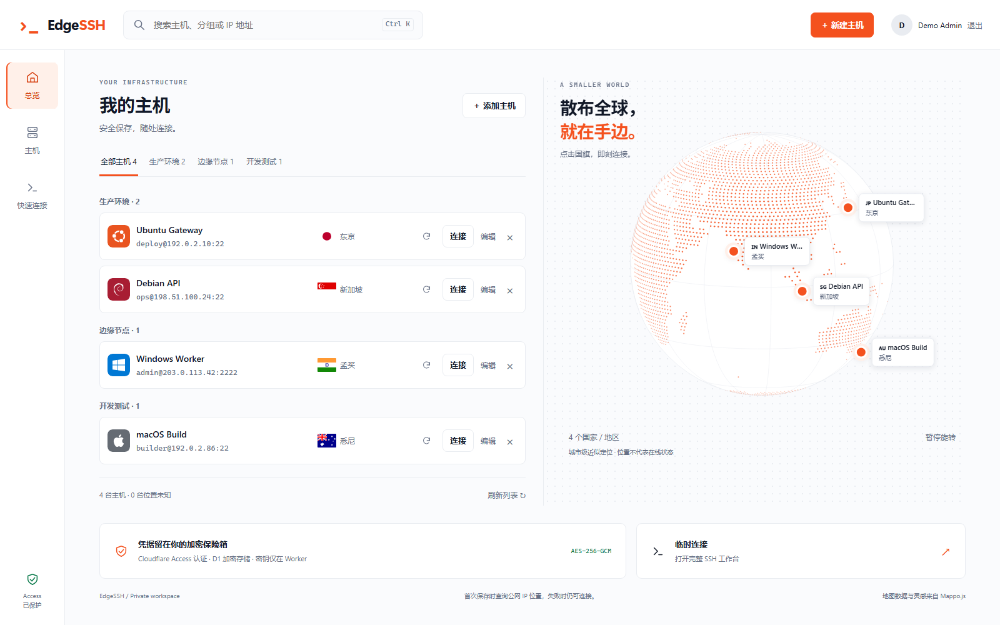

> **本项目基于 [Worker Web SSH（CF-Workers-WebSSH）](https://github.com/cmliu/CF-Workers-WebSSH) 深度开发。**<br>
> 在上游原生 WebSSH 能力的基础上，扩展主机管理、加密云端存储、地球可视化与操作系统识别，打造面向个人管理员的云端 SSH 工作台。感谢原作者的开源贡献。

<div align="center">

# EdgeSSH

**打开浏览器，连接你的服务器。**

运行于 Cloudflare Workers 的轻量 SSH 工作台<br>
主机总览 · 交互终端 · 文件管理 · 进程监控

<p>
  
  
  
</p>

[功能特性](#功能特性) · [界面预览](#界面预览) · [快速开始](#快速开始) · [本地开发](#本地开发) · [安全与限制](#安全与限制)

</div>

---

## 界面预览

<div align="center">



<sub>演示数据使用保留地址，不对应任何真实服务器。</sub>

</div>

## 功能特性

<table>
  <tr>
    <td width="50%" valign="top">
      <h3>🗂️ 主机管理</h3>
      <p>集中保存服务器资料与连接凭据，支持搜索、分组筛选与编辑。从列表直接进入工作台，无需反复输入连接信息。</p>
    </td>
    <td width="50%" valign="top">
      <h3>🌍 地球可视化</h3>
      <p>以可交互地球呈现主机地理位置，支持点位连接、刷新定位，配合城市与国旗展示服务器分布。</p>
    </td>
  </tr>
  <tr>
    <td valign="top">
      <h3>⌨️ 浏览器终端</h3>
      <p>基于 xterm.js，支持交互式 Shell、窗口尺寸同步、全屏与会话日志，适配桌面和移动端，工作台支持中英文切换。</p>
    </td>
    <td valign="top">
      <h3>📁 SFTP 文件管理</h3>
      <p>在终端旁浏览远程目录，上传与下载文件、新建目录、重命名，以及删除文件或空目录。</p>
    </td>
  </tr>
  <tr>
    <td valign="top">
      <h3>📊 实时进程面板</h3>
      <p>通过独立通道查看远端进程与 CPU、负载、内存和 Swap 信息，无需离开 SSH 工作台。</p>
    </td>
    <td valign="top">
      <h3>🐧 系统自动识别</h3>
      <p>通过 SSH 命令探测操作系统，记录系统版本与架构，并以品牌色圆角图标区分常见系统与发行版。</p>
    </td>
  </tr>
</table>

### 不只是一个终端

- **边缘原生**：Worker 通过 Cloudflare TCP Sockets 直接连接 SSH 服务器，无需额外部署 SSH 中转服务，每个会话由 Durable Object 隔离。
- **身份保护**：使用 Cloudflare Zero Trust Access 认证管理员，不提供匿名连接入口或本地注册登录。
- **加密存储**：主机资料、密码、私钥与指纹通过 AES-256-GCM 加密后保存到 D1，浏览器不持久化连接凭据。
- **指纹确认**：首次连接时展示服务器 SHA-256 指纹，确认后才发送 SSH 凭据。
- **灵活连接**：支持密码、单密码提示的 keyboard-interactive，以及未加密 OpenSSH 私钥认证；支持 UTF-8、GB18030、Big5 终端编码。
- **轻量实现**：TypeScript + Vite + Web Crypto；地球采用 Canvas 球面投影，不引入 Three.js 等大型三维依赖。

## 工作原理

```text
浏览器 · 主机总览 / xterm.js / SFTP / 进程面板
    │ HTTPS / WebSocket · Cloudflare Access 身份认证
    ▼
Cloudflare Worker
    ├── 静态资源与 API
    ├── 主机资料加密读写 ──→ D1
    └── 一次性会话票据
            ▼
    Durable Object · 每会话 SSH 客户端
            │ Cloudflare TCP Socket
            ▼
        公网 SSH 服务器
```

SSH 握手、密钥交换、认证与通道逻辑在 Worker 内完成。浏览器连接的是 Worker，而不是直接建立到服务器的 TCP 连接。

## 快速开始

### 环境准备

- Node.js **22.12.0 或更高版本**，以及 npm。
- 可使用 Workers、Durable Objects 与 D1 的 Cloudflare 账户。
- Cloudflare Zero Trust Access 应用。自定义域名可选；默认可直接使用账户的 `workers.dev` 域名。
- 一台你有权访问的公网 SSH 服务器。

### 配置 Cloudflare Zero Trust Access

EdgeSSH 没有独立的本地登录系统，正式入口必须先经过 Cloudflare Zero Trust Access。首次部署时请先完成：

1. 在 **Zero Trust > 访问控制（Access controls）> 应用程序（Applications）** 创建 **自托管和私有应用（Self-hosted and private）**，并绑定 EdgeSSH 的实际访问域名。默认可填写 `<WORKER_NAME>.<你的 Workers 子域>.workers.dev`，同时将 `CUSTOM_DOMAIN` 留空；只有真正绑定自定义域名时才填写 `CUSTOM_DOMAIN`。
2. 添加一条 **允许（Allow）** 策略，使用 **包括（Include）> 电子邮件（Emails）** 明确填写管理员邮箱；不要使用 **所有人（Everyone）** 或 **绕过（Bypass）**。
3. 选择 **标识提供程序（Identity Provider）**。个人部署可使用 **一次性 PIN（One-time PIN）**；新建 Zero Trust 组织若没有该选项，需要先到 **集成（Integrations）> 标识提供程序（Identity providers）** 手动添加。
4. 从 Access 应用中取得 **应用受众 (AUD) 标签（Application Audience (AUD) Tag）**，并从 Zero Trust **设置（Settings）** 取得 **团队域（Team Domain）**。
5. 将它们分别写入 `ACCESS_AUD` 与 `ACCESS_TEAM_DOMAIN` Worker 机密（Secret）。

完整的控制台点击步骤、OTP 配置、参数获取和故障排查见 **[Cloudflare Zero Trust 配置指南](docs/ZERO_TRUST.md)**。

### 获取项目

```bash
git clone https://github.com/aozorae/EdgeSSH.git
cd EdgeSSH
npm ci
```

### 配置与部署

> [!IMPORTANT]
> 本项目面向**单管理员**使用。Access 策略应仅允许管理员的明确身份，不要配置**所有人（Everyone）**或**绕过（Bypass）**。缺少 Access 配置时，受保护 API 会拒绝访问，不会降级为匿名网关。

1. 确定实际访问域名。默认入口为 `https://edgessh.<你的 Workers 子域>.workers.dev`；若通过 `WORKER_NAME` 修改 Worker 名称，入口中的 `edgessh` 也随之改变。自定义域名不是必需项。
2. 在 Zero Trust 控制台为该实际访问域名创建**自托管和私有应用（Self-hosted and private）**，只允许管理员的明确邮箱或身份，并记下**团队域（Team Domain）**与**应用受众 (AUD) 标签（Application Audience (AUD) Tag）**。
3. 在 GitHub Actions 中配置部署变量与机密（Secret），首次运行 `Deploy` 工作流（workflow）。工作流会在目标账户中按名称复用或创建 D1、应用迁移、同步 Worker 机密，并创建或更新 Worker。
4. 部署完成后打开实际 Access 入口验收。以后重复运行会复用同名 Worker 与 D1，不需要手工复制 `database_id` 或修改 `wrangler.toml`。

| 配置 | 类型与位置 | 示例值 | 用途 |
| --- | --- | --- | --- |
| `DB` | `wrangler.toml` 中的 D1 binding | `DB` | 保存加密主机资料 |
| `SSH_SESSIONS` | `wrangler.toml` 中的 Durable Object binding | `SSH_SESSIONS` | 隔离 SSH 会话 |
| `ASSETS` | `wrangler.toml` 中的静态资源 binding | `ASSETS` | 提供前端资源 |
| `ACCESS_TEAM_DOMAIN` | GitHub Actions 机密（Secret） | `my-team.cloudflareaccess.com` | Access 团队域名，部署时同步为 Worker 机密 |
| `ACCESS_AUD` | GitHub Actions 机密（Secret） | `012345…`（常见外观） | Access 应用的应用受众 (AUD) 标签（Application Audience (AUD) Tag），必须原样复制实际值，部署时同步为 Worker 机密 |
| `ENCRYPTION_KEY` | GitHub Actions 机密（Secret） | `AbCd…=`（44 字符 Base64） | 32 字节安全随机密钥的标准 Base64，部署时同步为 Worker 机密；不要使用示例文本 |
| `CONNECT_TIMEOUT_MS` | 可选普通变量 | `10000` | TCP 建连超时；仓库已有默认值，通常无需填写 |

生产运行时的 `ACCESS_TEAM_DOMAIN`、`ACCESS_AUD` 与 `ENCRYPTION_KEY` 统一保存在 GitHub Actions 机密（Secret）中，由工作流通过标准输入同步为 Worker 机密，不写入仓库或普通变量。`DB`、`SSH_SESSIONS` 与 `ASSETS` 是部署时创建的绑定，不是环境变量；`CONNECT_TIMEOUT_MS` 已有默认配置，也无需重复添加。

**首次部署才生成 `ENCRYPTION_KEY`，后续部署始终复用原值。** 丢失或直接替换密钥会导致已有资料无法解密。密钥只保存为 GitHub Actions 机密（Secret），不要写入源码、`wrangler.toml`、普通变量或提交记录。

完整配置顺序、安全边界与验收清单见 [部署指南](DEPLOYMENT.md)。

### GitHub Actions 自动部署

仓库内置的 `Deploy` 工作流（workflow）会在推送到 `main` 后自动检查、迁移 D1 并部署，也可在 Actions 页面手动触发。首次使用前，在仓库的**设置（Settings）> 机密和变量（Secrets and variables）> Actions**中配置：

| 名称 | GitHub 配置类型 | 示例值 | 用途 |
| --- | --- | --- | --- |
| `CLOUDFLARE_ACCOUNT_ID` | 变量（Variable） | `0123456789abcdef0123456789abcdef` | Cloudflare 账户 ID |
| `CLOUDFLARE_API_TOKEN` | 机密（Secret） | `Cloudflare 生成的令牌` | 具备 Workers 部署和 D1 迁移权限的 API 令牌（API Token） |
| `ACCESS_TEAM_DOMAIN` | 机密（Secret） | `my-team.cloudflareaccess.com` | Zero Trust 团队域（Team Domain） |
| `ACCESS_AUD` | 机密（Secret） | `012345…`（常见外观） | 实际访问域名对应 Access 应用的 AUD，必须原样复制实际值 |
| `ENCRYPTION_KEY` | 机密（Secret） | `AbCd…=`（44 字符 Base64） | 首次生成后长期复用的随机密钥；不要使用示例文本 |

| 可选名称 | GitHub 配置类型 | 示例值 | 用途 |
| --- | --- | --- | --- |
| `WORKER_NAME` | 变量（Variable） | `my-edgessh` | 覆盖默认 Worker 名 `edgessh` |
| `D1_DATABASE_NAME` | 变量（Variable） | `my-edgessh-accounts` | 指定 D1 名称 |
| `D1_DATABASE_ID` | 变量（Variable） | `00000000-0000-4000-8000-000000000001` | 复用一个已知 D1 数据库 |
| `CUSTOM_DOMAIN` | 变量（Variable）或机密（Secret） | `ssh.example.com` | 仅用于真正的自定义域名；使用 `*.workers.dev` 时必须留空 |

全部可选值省略时，工作流使用 `edgessh`、自动创建或复用 `edgessh-accounts`，并发布到该账户的 `workers.dev` 域名。`CUSTOM_DOMAIN` 推荐使用 Variable，但兼容 Secret；两处同时设置时 Secret 优先。

创建 API 令牌（API Token）时，可使用 Cloudflare 的**编辑 Cloudflare Workers（Edit Cloudflare Workers）**模板并补充 `D1: Edit`。只使用 `workers.dev` 时不需要目标区域（Zone）的自定义域名权限；设置 `CUSTOM_DOMAIN` 时，再将区域资源限制到实际使用的域名。API 令牌和运行时机密都必须保存为 GitHub 机密（Secret），不能保存为普通变量（Variable）。

## 本地开发

安装依赖并准备本地变量：

```bash
npm ci
cp .env.example .dev.vars
npx wrangler d1 migrations apply DB --local
npm run dev
```

按部署指南在 `.dev.vars` 中填写所需配置。本地开发仍保留 Access 身份校验，不提供匿名绕过；本地变量文件不得提交。

需要前端热更新时，在另一个终端运行 `npm run dev:web`。Vite 默认位于 `http://localhost:5173`，将 `/api` 代理到本地 Worker 的 `8787` 端口；公网目标限制在本地同样生效。

| 命令 | 说明 |
| --- | --- |
| `npm run dev` | 构建前端并启动本地 Worker |
| `npm run dev:web` | 启动 Vite 前端开发服务器 |
| `npm run build:web` | 构建前端到 `dist/` |
| `npm run typecheck` | 检查 Worker 与前端类型 |
| `npm test` | 运行测试 |
| `npm run check` | 类型检查、测试与部署 dry-run（包含前端构建） |
| `npm run deploy` | 构建前端并部署 Worker |

## 项目结构

```text
EdgeSSH/
├── .github/workflows/ # GitHub Actions 自动部署
├── frontend/          # 主机总览、地球可视化与 SSH 工作台
├── src/
│   ├── accounts/      # Access 认证、主机管理与加密存储
│   ├── backend/       # 会话生命周期、SFTP 与系统信息探测
│   ├── ssh/           # SSH 协议、认证、密码学与通道
│   └── worker.ts      # HTTP、API 与 WebSocket 入口
├── migrations/        # D1 数据库迁移
├── tests/             # 自动化测试
├── DEPLOYMENT.md      # 部署与验收指南
└── wrangler.toml      # Worker 与资源绑定配置
```

## 安全与限制

### 安全边界

- **不是端到端加密**：Worker 是实际的 SSH 客户端，会在会话内处理明文凭据。请仅部署到可信账户，并使用最小权限的 SSH 账号或密钥。
- 主机资料绑定 Access 身份；会话使用一次性票据，辅助通道使用附着令牌，并检查同源请求。
- 连接目标仅限公网地址；域名解析后校验目标 IP，降低 SSRF 与 DNS 重绑定风险。
- 地理定位会向外部定位服务发送服务器公网 IP，不发送 SSH 凭据或命令；位置点位**不代表在线状态**。
- `workers.dev` 与自定义域名都可以作为正式入口，但所选入口必须由对应的 Cloudflare Access 应用保护；不要把未受 Access 保护的地址当作公开 SSH 入口。

### 当前支持范围

| 类别 | 支持情况 |
| --- | --- |
| 会话 | SSH 2.0、交互式 Shell、PTY、窗口尺寸同步、Keepalive |
| 文件协议 | SFTP v3；单文件上传与下载上限 64 MiB；仅删除空目录 |
| 私钥认证 | 未加密 OpenSSH Ed25519、RSA、ECDSA P-256/P-384/P-521 |
| 主机管理 | 每个身份最多 200 台；不支持团队共享 |
| 终端编码 | UTF-8、GB18030、Big5，取决于浏览器解码支持 |

暂不支持加密私钥、PEM/PKCS#8 私钥、SSH Agent、多因素键盘交互认证、SCP、端口转发、ProxyJump、SSH 压缩与会话内 rekey；不支持出站 TCP 25 端口。

## 参与贡献

欢迎通过 Issue 反馈问题或通过 Pull Request 提交改进。提交前请运行 `npm run check`；涉及连接、文件传输或进程面板的改动，请使用真实且已获授权的 SSH 目标验证。

反馈时请附上复现步骤和必要的环境信息，**不要上传密码、私钥、Access Token 或未脱敏的日志**。

## 贡献者

- [CM / cmliu](https://github.com/cmliu)：原作者，完成项目的初始设计与核心实现。
- [aozorae](https://github.com/aozorae)：当前维护者。

## 致谢

- [Worker Web SSH / cmliu/CF-Workers-WebSSH](https://github.com/cmliu/CF-Workers-WebSSH)：本项目的直接上游与开发基础。
- [huashengdun/webssh](https://github.com/huashengdun/webssh)：WebSSH 终端与前端兼容 API 参考。
- [newbietan/CloudSSH](https://github.com/newbietan/CloudSSH)：Cloudflare Workers SSH 实现参考。
- [crazypeace/huashengdun-webssh](https://github.com/crazypeace/huashengdun-webssh)：WebSSH 二次开发与前端兼容性参考。

## 许可证

本项目采用 [Apache License 2.0](LICENSE)。使用、修改与分发时，请保留适用的许可证与版权声明。
